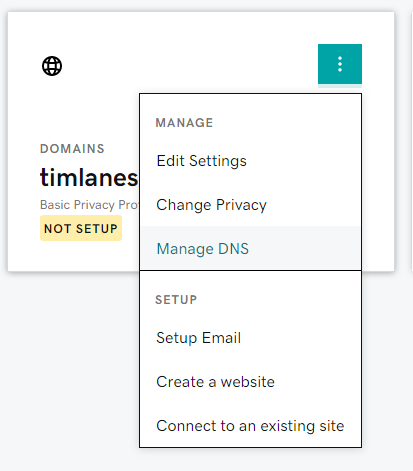

You may recall my [previous (somewhat naive) article](https://timlanesoftware.com/Decentralising-Data/) where I talked about an exciting new-ish web technology [called Solid](https://solidproject.org/) spearheaded by Tim Berners Lee, widely known as the creator of the web. One of the main advantages of Solid pods is that you not only maintain control over which apps and services may access your personal data at any given time, but you can even self-host your pod(s) which store that data. This is a nice advantage over classic centralised server systems, as it means you can not only control access to your data _virtually_ but also _physically_, so you can do anything you want with it. By removing the middle-men typically responsible for looking after our data, you can have complete control over it. It also helps avoid issues with webservices shutting down and taking all your data with it, as you become primarily responsible for storing your own data. Or for example, in a rather unfortunate and somewhat ironic case, [a major Solid pod hosting service going down without much warning and taking user's WebIDs with it](https://lists.w3.org/Archives/Public/public-solid/2020Oct/0020.html) (though fortunately, the data was all backed up and shifted over to a new domain).

This adds to the growing number of reasons everyone should have full control and responsibility over their data, down to the physical hardware you store it on. Of course, Solid also builds upon usage of [linked data and the semantic web](https://en.wikipedia.org/wiki/Semantic_Web). The bad news is - the bar of entry for setting up your own servers to connect to the web is a high one, and setting up a Solid server is no exception. While there is a [rudimentary guide to self-hosting a Solid pod server hidden away on the main website](https://solidproject.org//self-hosting/nss), it isn't immediately obvious how to do it. Perhaps in the future, setting up home internet servers and Solid pods will become a breeze, but until then I'm here to help you get started with a more detailed guide to hosting your own Solid pod on the cheap with a Raspberry Pi.

## What can I actually do with Solid, and how does it work?

While Solid is in it's early days and [the specification](https://github.com/solid/solid-spec) is still pre-1.0 (at the time of writing), there are a few [official apps and prototypes](https://solidproject.org/apps) around that you start making use of immediately or tinker with to get an idea of how you can develop your own Solid-oriented applications. In essence, Solid is a [linked data platform (LDP)](https://programminghistorian.org/en/lessons/intro-to-linked-data) that has some features such as [web access control (WAC)](https://github.com/solid/web-access-control-spec) which essentially means it's a server that stores a bunch of nicely formatted data that can be accessed and modified by users or external applications to use for... well, anything! That's the beauty of Solid - it's essentially a playground of personal linked data that users and developers can interact with via web apps, but the owner of the pod in question has complete control over who or what can access it.

## Pre-requisites

Self-hosting a Solid pod does come at a cost, unfortunately, though these costs can be quite low. For this guide, you'll need the following:

1. A Linux server that can run a version of [Node](https://nodejs.org/en/) compatible with the [NSS (node-solid-server)](https://github.com/solid/node-solid-server). For this purpose, we are going to use a Raspberry Pi, a cheap yet powerful SOC (System-On-a-Chip) coming in around £50 for the latest version 4 (though older versions are around for cheaper - the original Raspberry Pi model B, which I will be using for this guide, cost around £30 back when I first got it several years ago. Be warned though, the server is extremely slow on the old pi...).
2. A domain name; domain names are the main part of URLs - for instance, the domain name of the site at http://example.com is simply [example.com](http://example.com). These can be "bought" (more like rented) via various domain name registrars, such as GoDaddy, NameCheap, Google Domains and many others, sometimes for as cheap as 99p for a year of use. It doesn't really matter too much what the domain name is, but whatever you pick will become part of your WebID via which other Solid users and apps identify your pod.
3. An internet connection via a configurable gateway such as a router or modem. If you have an internet connection, you'll probably have one of these with WiFi functionality provided by your ISP.

### Disclaimer

This is not intended to be an exact step-by-step tutorial, but rather a guide that will hopefully get you over 90% of the way to victory. Unfortunately, domain name registrars, router & modem models as well as different versions of the software tools used will all have slightly different quirks and user interfaces, so this isn't going to be completely comprehensive. Hopefully however, you should be able to follow along and work out the small differences here and there, as the core process should remain the same (for the near future, at least).

## Installing the server

Before doing anything, you should make sure you can SSH into your pi (or alternatively you can use a spare keyboard and monitor to access the command line directly). If you don't know what SSH is, it's essentially an internet protocol that allows you to remotely operate the command line on another computer. You can find various tutorials on connecting to a pi via SSH with google, though to save time you can try out [this tutorial](https://howchoo.com/g/mgi3mdnlnjq/how-to-log-in-to-a-raspberry-pi-via-ssh). From here onwards, you can expect any commands shown to be entered on the pi unless specified otherwise.

At the time of writing, the primary implementation of the Solid specification is the [node-solid-server](https://github.com/solid/node-solid-server). This is a basic server with a [WebID login service](https://www.w3.org/2005/Incubator/webid/spec/tls/) and a rather unintuitive web interface ([fortunately there is a user guide](https://github.com/solid/userguide)) that implements the [Solid protocol](https://solidproject.org/TR/protocol). Solid is implemented as a JavaScript server running as a Node package. In order to install it therefore, you will need to first install the Node. In order to run NSS version 5.4.4, your server <u>must support</u> Node version 12.19.0 or newer at the time of writing; however, newer versions of NSS may require a more recent Node version, so make sure you check. On more recent Raspberry Pi models, it's recommended that you install nvm, a version manager for Node and it's applications, then install Node itself via that - check out [this short guide](https://www.jemrf.com/pages/how-to-install-nvm-and-node-js-on-raspberry-pi) for more information. Once Node is installed with `nvm`, you can go ahead and install Solid with `sudo npm install -g solid-server`.

### Note on running NSS with the original Raspberry Pi model B

If you have a newer pi with a Broadcom processor or an ARMv7+ chip (at the time of writing), you can skip this section. If however, like me, you decided to make use of an old pi model then you may run into some nasty issues with Node versions and out of date package managers... Fortunately, there is hope. If you have an original pi model B with the ARMv6 processor, instead of installing Node through `nvm`, you should install the version you need for NSS from the `experimental` branch as stable support for the old processor has stopped. To do this, you will need to download, extract and install the binary package ye olde way from the [unofficial builds directory](https://unofficial-builds.nodejs.org/download/release/). I have tried and tested NSS version 5.5.4 with the [Node version 12.19.0 for ARMv6](https://unofficial-builds.nodejs.org/download/release/v12.19.0/node-v12.19.0-linux-armv6l.tar.gz) binaries, and it seems to work, but as I say, ensure you are using the appropriate version of Node for the version of NSS you are using. FYI, I used a fresh installation of the "Lite" version of Raspbian on my Pi (no GUI/desktop environment), though things will probably work fine on other distributions too. General steps for setting things up:

1. `wget https://unofficial-builds.nodejs.org/download/release/v12.19.0/node-v12.19.0-linux-armv6l.tar.gz`
2. `tar xvzf node-v12.19.0-linux-armv6l.tar.gz`
3. `sudo ln -s node-v12.19.0-linux-armv6l/bin/node /usr/local/bin/node`
4. `sudo ln -s node-v12.19.0-linux-armv6l/bin/npm /usr/local/bin/npm`
5. `sudo ln -s node-v12.19.0-linux-armv6l/bin/npx /usr/local/bin/npx`

In effect, these steps download Node (including `npm`, Node Package Manager), extract it, then setup symbolic links to the binaries so that they can be run anywhere. You can now run `sudo npm install -g solid-server` as you would normally to install the server.

## Configuring the server

Once node-solid-server is installed, you need to configure it; change directory with `cd /var/www/` and make a new directory with the same name as your domain name e.g. `sudo mkdir your.host.example.org`, change directory `cd your.host.example.org` then run `sudo solid init`. This will follow with a set of questions to configure the server, which are generally self-explanatory; you can refer to the [official guide](https://solidproject.org//self-hosting/nss) which shows an example response. A brief explanation of the options (note, for options with default values, you can hit the enter/return key to use the default):

- `* ? Path to the folder you want to serve. Default is (./data)` 
  
  Specify the directory where all the user pods will be stored. Hit enter to use the default "data" folder.
  
- `? SSL port to run on. Default is (8443)`
  
  Specify which port the server will run on. Unless you are already using port 8443 for something else, I recommend using the default.
  
- `? Solid server uri (with protocol, hostname and port)`
  
  Specify what the root URL of the server will be _including_ the `https://` protocol prefix, e.g. `https://your.host.example.org`
- `? Enable WebID authentication (y/N)`
  
  Answer yes to this - you can only use external Solid web apps with your pod(s) if you have this enabled (effectively for single sign-on).
  
- `? Serve Solid on URL path`
  
  Use current directory by default (assuming you are in `/var/www/your.host.example.org`).
  
- `? Path to the config directory (for example: /etc/solid-server) (./config)`
  
  Fairly self-explanatory, contains some for the server to use, default is fine.
  
- `? Path to the config file (for example: ./config.json) (./config.json)`
  
  Ditto.
  
- `? Path to the server metadata db directory (for users/apps etc) (./.db)`
  
  Ditto.
  
- `? Path to the SSL private key in PEM format`
  
  Here you must specify the file containing the private key used for HTTPS - we haven't generated this yet, but later on in this guide I will be using [Let's Encrypt](https://letsencrypt.org) for encryption and to obtain a SSL certificate for the site. For now enter `/etc/letsencrypt/live/your.host.example.org/privkey.pem`
  
- `? Path to the SSL certificate key in PEM format`
  
  This is specifically for the SSL certificate, again this will be obtained later. For now enter `/etc/letsencrypt/live/your.host.example.org/fullchain.pem`
  
- `? Enable multi-user mode (y/N)` 
  
  Depending on how you wish to use your pod, you may wish to support multiple pods for multiple users - meaning that each new user will have their own their own subdomain, making up their WebID. For example, if I created a new user "tim" then the WebID for that user would be https://tim.your.host.example.org. If you don't want anyone else to make their own user accounts, you can disable multi-user mode and there will only be one pod on the server with the WebID being the same as the domain name, i.e. https://your.host.example.org.
  
- `? Do you want to set up an email service (y/N)`
  
  I won't be covering the email service in this guide, so I left it disabled.
  
- `A name for your server (not required)`
  
  If you like you can name your server something; if you leave it undefined it defaults to the domain name.
  
- `? A description of your server (not requred)`
  
  Optional server description.
  
- `? A logo (not required)`
  
  Optional custom logo image path.
  
- `? Do you want to enforce Terms & Conditions for your service (y/N)`
  
  If you expect other users to sign up to the server, this might be a good idea.
  
- `? Do you want to disable password strength checking (y/N)`
  
  Self-explanatory, ensures users passwords are good when they sign up.
  
- `? The support email you provide for your users (not required)`
  
  If you expect other users to sign up to the server, this will be public for them to contact if they need support.

Once you finish initialising the server, a configuration file will be created.

## Serving Solid on the internet

In order to get Solid working with external web apps, you will need it to serve HTTPS on the internet. First you must setup the local network so the server can be accessed externally, then configure the domain name to direct traffic to the server, and finally setup an SSL certificate. You should also setup a HTTP to HTTPS redirect so that when users connect to http://your.host.example.org they are correctly connected to https://your.host.example.org instead; for this purpose I have created a simple HTTP python server script, but apparently there are things out there such as Nginx that can be used to do the same thing.

## Local network setup

First and foremost, you should set the hostname of your server to match the domain name. On the Raspberry Pi this is quite straightforward using `sudo raspi-config`, selecting `Network Options` then `Hostname` and entering the main domain name **without** the top level domain(s) e.g. `your.host.example`. See [this tutorial](https://pimylifeup.com/raspberry-pi-hostname/) for a more visual guide under the raspi-config section (or you can manually modify the hostnames file).

Once this is done, it's time to do some port forwarding. As the server can't be run easily on port 443 (the standard HTTPS port) due to permissions, the forwarding should map from external port 443 to internal port 8443 which the server uses. To do this, you need to find out the IP address of the server - you can either do this with the `ipconfig` command (though if you're SSH'd into the pi, you should know this already) or you might be able to see the address via your router settings page (probably accessible at 192.168.0.1 in your web browser). Once you're on the router settings page, navigate to your port forwarding settings (on Virgin hub 3.0 this is under Advanced Settings -> Security -> Port Forwarding, but this will differ between router models). As well as the external 443 to internal 8443 port mapping (TCP), you should forward external port 80 to internal port 80 (TCP) and optionally port 8080 in the same way, as these will allow the HTTP to HTTPS redirect service to work later. In this example the IP of my pi is `192.168.0.29`.

Apply the changes, and things should be ready for assigning the domain name.

## Configuring the domain name

Once port forwarding is setup, we can go ahead and configure the domain name DNS. To do this, you'll need to navigate to the registrar site you bought your domain name from in a web browser and find the DNS records management page. This will differ between domain name registrars, but the general process is the same. For this guide I will show examples with GoDaddy.

 

Once on the DNS management page for your domain name, you should add two new `A` records. The first record should have the name set as the domain itself; in GoDaddy this is represented by the @ symbol, though this may differ between registrars. The value should be the public IP address of your internet gateway/router; this can be easily found via google by typing in "What is my IP" or going to [https://whatismyipaddress.com](https://whatismyipaddress.com) (assuming you are on the same local network as the server). 

Once these `A` records are added, there's just one more key step to get the server working - setting up an SSL certificate. Leave the DNS records management page open for now as we'll come back to it shortly.

### Note on DNS propagation

When you add or modify DNS records, the changes take some time to apply due to DNS propagation - basically, all the nameservers make up DNS must be updated across the world. Therefore you will likely have to wait a short time before changes take affect, so bear this in mind when testing stuff or obtaining an SSL certificate via a DNS challenge. You can [check DNS propagation here](https://www.whatsmydns.net).

## Obtaining an SSL certificate

A requirement of Solid pod servers is that they should provide HTTP over SSL (Secure Socket Layer) which ensures that all requests are securely encrypted. In order to verify this encryption, you need to get an SSL certificate and keep it up-to-date. While there are paid SSL certification services, you can easily setup SSL for free using [Let's Encrypt](https://letsencrypt.org). There is a [brief section in the official NSS setup guide](https://solidproject.org//self-hosting/nss) that details everything we need to download, install and run `certbot-auto` to verify both the root domain and wildcard subdomain certificates, though I've noticed a couple of issues with it so I've made some changes - follow these steps on the pi:

~~~~~~~~bash
$ wget https://dl.eff.org/certbot-auto
$ sudo mv certbot-auto /usr/local/bin/certbot-auto
$ sudo chown root /usr/local/bin/certbot-auto
$ sudo chmod 0755 /usr/local/bin/certbot-auto
~~~~~~~~

First the certification program `certbot-auto` is downloaded, moved into the user's local binaries directory (so it can be run from anywhere) before changing the ownership to the root user and setting appropriate permissions. Note - if this or the next step doesn't work, take a look at [the official certbot instructions](https://certbot.eff.org/instructions) and choose the system that best matches the Linux distro your pi uses.

Now we run `certbot-auto` with `--manual` and `--agree-tos` set so we can manually verify the domain and automatically agree to the terms of service respectively. We also set `--preferred-challenges=dns` such that the domain validation can be done via `TXT` records in our domain DNS settings. We must also set an email address to register (also for recovery in case of a problem), using `--email` followed by any contact addresses (in this example `mail@host.com` should be replaced by your actual email address). We also specify the web server used to verify the DNS challenges with `--server` followed by the URL; we use `https://acme-v02.api.letsencrypt.org/directory` for this. Finally, we use the `-d` option to specify the main domain and wildcard subdomains for certificates (replacing `your.host.example.org` with the domain you configured).

~~~~~~~~bash
$ sudo certbot-auto certonly --manual --preferred-challenges=dns --email mail@host.com --server https://acme-v02.api.letsencrypt.org/directory --agree-tos -d your.host.example.org -d *.your.host.example.org
~~~~~~~~

This may take a short time to run, but once it gets going you will be asked to create a `TXT` record for your domain and pasting in the values they give you (note, it should ask you to add two records, one for the root domain and one for the wildcard subdomains). This is a [DNS challenge](https://letsencrypt.org/docs/challenge-types/) that verifies the domain is genuinely pointing at the address of your pi. To set this up, you must once again go to the DNS records management page for the domain you're using (the same page the `A` records were added), but this time add a new `TXT` record. `certbot` should tell you what the name and value should be (though note that on GoDaddy at least, the name should just be the lowest level domain, i.e. just `_acme-challenge`). The value will be a unique generated string of characters you can copy and paste in. Once you've added the `TXT` record, you will have to wait a short time for DNS propagation as before. As long as the majority of nameservers are updated, it should be fine to continue - you can check the propagation of different records for a given domain at [https://www.whatsmydns.net](https://www.whatsmydns.net).

Once the changes have propagated to most of the nameservers, you can go ahead and continue with `certbot`.

### Some final steps before running the server

In order for the server to have access to the newly generated SSL files, we do have to change some permissions, otherwise errors will occur. To do this, run the following commands:

~~~~~~~~bash
$ sudo chmod -R 755 /etc/letsencrypt/live/
$ sudo chmod -R 755 /etc/letsencrypt/archive/
~~~~~~~~

This ensures that the server works - the second command is actually omitted from the official NSS guide, but I discovered the `live` directory merely contained symbolic links to files in the `archive` directory, so this is a necessity.

## HTTP to HTTPS redirect (reverse proxy)

At this point, you should be able to run the server - but it may not work correctly. Unfortunately, NSS doesn't provide a HTTP to HTTPS redirect service, so people trying to connect to the server with HTTP instead of HTTPS may not be able to authenticate or view/modify their data. Therefore we must setup a reverse proxy to do it for us. The [official NSS guide](https://solidproject.org//self-hosting/nss) does include details on setting up Nginx or Apache for this purpose, so you could try those - but I decided to resolve the problem myself with a [basic HTTP Python server](https://github.com/SpectralCascade/http2https) that redirects all requests to HTTPS. This means you will need Python 3 installed on your pi. All it does is take a HTTP request (on port 8080 by default - though you should run it on port 80 ideally) and redirects to the HTTPS version of the URL so NSS can handle it. Here's the steps to get it up and running on port 80:

~~~~~~~~bash
$ sudo apt-get install python3
$ sudo apt-get install git-scm
$ cd ~
$ git clone https://github.com/SpectralCascade/http2https.git
$ cd http2https
$ sudo ln -s /usr/local/bin/http2https.py /home/pi/http2https.py
$ sudo ln -s /usr/bin/http2https.py /home/pi/http2https.py
$ sudo python3 http2https.py 80
~~~~~~~~

Note the `ln` commands here where we create symbolic links to the `http2https` script in the user binary directories so it can be run from anywhere (note this assumes your user is called `pi`, if it's different you need to change these commands accordingly).

## Running the server and connecting to the web interface

Now everything is installed and setup, you can go ahead and `cd /var/www/your.host.example.com` (again, replacing `your.host.example.com` with the actual domain/directory name) then run `sudo solid start`. You may have to wait a minute or two for things to startup, but after that, assuming there are no errors, you can go ahead and try connecting to the web interface by going to `https://your.host.example.com`. Here you can create a user pod, login and take a look at your profile under `https://your.host.example.com/profile/card#me`. As mentioned earlier, there is a [guide to the data browser on GitHub](https://github.com/solid/userguide).

Congratulations! If you've reached this far you've managed to setup your own Solid server, which you can now use with other web apps that form the Solid ecosystem. I intend to do another article at some point in the future about what things you _can_ do with Solid at present, ideas for future development and my general opinion after I've messed around with things a bit more. Before that however, there are a few other things you should do, or at least keep in mind...

### Automatic server restart

Should your pi reboot for whatever reason, or the server crashes, then at present it will simply stay dead and no-one will be able to access your server. Uh oh! However, Linux provides us with `services` via `systemd` which enables you to set things up to run automagically when the pi boots or the server crashes.

We will need this for both NSS and the Python 3 reverse proxy. First and foremost however, we will create a user to deal with these for us. Run the following commands to create a new user named `solid` (don't just copy paste these - remember to change `your.host.example.org` to whatever your domain is):

~~~~~~~~bash
$ sudo adduser --system --ingroup www-data --no-create-home solid
$ cd /var/www/your.host.example.org/
$ sudo chown solid:www-data config.json
$ sudo chown solid:www-data -R config/ data/ .db/
~~~~~~~~

This creates the new `solid` user which will have control over the Solid server and reverse proxy. Next, we must create files for the services that tells `systemd` how to run NSS and the reverse proxy:

~~~~~~~~bash
$ sudo touch /lib/systemd/system/solid.service
$ sudo touch /lib/systemd/system/http2https.service
~~~~~~~~

Once these files are created, you can go ahead and edit them with the text editor of your choice. For this example, I will use `nano` with the command `sudo nano /lib/systemd/system/solid.service` to edit the Solid service first. Copy and paste the following but change the working directory folder `your.host.example.org` to whatever your domain name is and save the file:

~~~~~~~~bash
[Unit]
Description=solid - Social Linked Data
Documentation=https://github.com/solid/node-solid-server
After=network.target

[Service]
Type=simple
User=solid
WorkingDirectory=/var/www/your.host.example.org/
ExecStart=/usr/local/bin/solid start
Restart=on-failure

[Install]
WantedBy=multi-user.target
~~~~~~~~

In essence, this file specifies what the service is, the working directory it should execute in, what the command should be to start it, and that it should restart on failure. The `https2https` service is similar - this time edit the `http2https.service` file with the command `sudo nano /lib/systemd/system/http2https.service` and copy-paste the following:

~~~~~~~~bash
[Unit]
Description=Python3 HTTP server that auto-redirects to HTTPS

[Service]
Type=simple
ExecStart=/usr/bin/python3 /usr/local/bin/http2https.py 80
User=solid
Group=www-data
AmbientCapabilities=CAP_NET_BIND_SERVICE

[Install]
WantedBy=multi-user.target
~~~~~~~~

Note the line `AmbientCapabilities=CAP_NET_BIND_SERVICE` - this allows the service to run the server on port 80, a necessity as this is the default port used with HTTP. Once you've saved this file and returned to bash, enter the command `sudo systemctl daemon-reload` to reload the `systemd` services daemon such that the file changes are detected, then run the following to start NSS and the reverse proxy (make sure you stopped the previously running NSS and reverse proxy program instances first):

~~~~~~~~bash
$ sudo systemctl start solid.service
$ sudo systemctl start http2https.service
~~~~~~~~

Now whenever your pi reboots or there's a failure, the servers will automagically restart for you.

### Beware of dynamic DNS

Another hurdle that you have to deal with when it comes to self-hosting any public internet server is dynamic DNS. Assuming you're on a home/non-business connection, your router/gateway's IP address assigned by your ISP is probably done dynamically. This means it can change at any moment, e.g. when you disconnect the router and reconnect it (though in practice, I've noticed mine has not changed for several months - possibly because it's just sitting powered on at all times). Of course, this has bad implications for any server hosting on your network - whenever the IP changes, the A records in your domain's DNS settings will become invalid, or worse, point to a completely different internet gateway. This means you won't be able to access the server online when dynamic DNS decides to shake things up a bit from time to time. There are a few solutions to this problem - you could get a static IP (this could cost money or be infeasible for other reasons), or pay your registrar for a dynamic DNS service that deals with this issue for you. Alternatively, you can set up a script on your pi to keep an eye on the public IP of the router/gateway, and whenever it changes, have it automagically update the `A` record values for your domain's DNS settings. While I haven't set this up yet myself (it could be a whole article in itself, and this article is too long already...), some registrars do have APIs you can use to do this, and thankfully some open-source programs you can install on your pi to do this for you. For instance, [this python program on GitHub for GoDaddy domains](https://github.com/CarlEdman/godaddy-ddns) or a [web service like no-ip](https://www.noip.com) can do these things for you.

### Renewing your SSL certificate

Finally, I would recommend setting up auto-renew for your SSL certificates - SSL certificates must be renewed as they expire every 90 days. While this isn't too necessary (as long as you have access to the server, you can manually update certificates by running `certbot-auto` in the same way I described earlier every 60-90 days), if you have this setup alongside a dynamic DNS correcting service the only time you should need to perform virtual maintenance for your server are system and software updates. You could probably even automate those too. Anyway, once again I am not going to get into the details of how to do this for now - but it's worth keeping in mind and having a look if you'd rather avoid having to do this process manually every so often.

## Conclusion

Finding out all this took some time; the official guide was rather light on the details and [I had some headaches setting stuff up](https://forum.solidproject.org/t/server-self-hosting-setup-issues/3589), hence I figured I'd share my findings here. Plus you get the benefit of knowing how to set things up on an original Raspberry Pi model B (though I would recommend using a newer model if possible, as those should have vastly better performance).

Many thanks to the team working on Solid and the community for their help! It's certainly an interesting project, and if it does take off it could revolutionise how we store our personal data. Until then, why not tinker with it and see what you can make? I do intend to write up another article or two focusing specifically on _why_ you'd want to use Solid, my opinions and the applications that are available currently, as well as a investigate making my own Solid apps. For now anyhoo, I'm off to make dinner and call this article done (no doubt I'll come across a number of mistakes later, but that's a problem for future me). Catch ya later!

